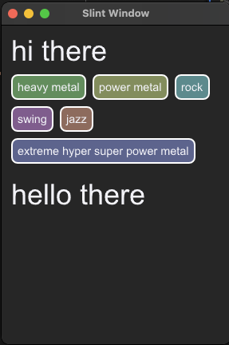

# Slint Flow Layout Demo

A demonstration of a flow layout in Slint, as shown in the list of music genres
below. Elements can be any Slint component that has a preferred-width
preferred-height:



## Known Issues

On first render, until you adjust the width of the component, the tags do not
lay out properly. Looking into this. I think it can be worked around with
a timer or animation that just wiggles the component's width 1px.

## Instructions

See main.rs and app-window.slint. Replace Tag with your component. It does
require the calculation code in main.rs, which you can attach anywhere in
your app. 


# Original Template Docs

## About

This template helps you get started developing a Rust application with Slint as toolkit
for the user interface. It demonstrates the integration between the `.slint` UI markup and
Rust code, how to react to callbacks, get and set properties, and use basic widgets.

## Usage

1. Install Rust by following its [getting-started guide](https://www.rust-lang.org/learn/get-started).
   Once this is done, you should have the `rustc` compiler and the `cargo` build system installed in your `PATH`.
2. Download and extract the [ZIP archive of this repository](https://github.com/slint-ui/slint-rust-template/archive/refs/heads/main.zip).
3. Rename the extracted directory and change into it:
    ```
    mv slint-rust-template-main my-project
    cd my-project    
    ```
4. Build with `cargo`:
    ```
    cargo build
    ```
5. Run the application binary:
    ```
    cargo run
    ```

We recommend using an IDE for development, along with our [LSP-based IDE integration for `.slint` files](https://github.com/slint-ui/slint/blob/master/tools/lsp/README.md). You can also load this project directly in [Visual Studio Code](https://code.visualstudio.com) and install our [Slint extension](https://marketplace.visualstudio.com/items?itemName=Slint.slint).

## Next Steps

We hope that this template helps you get started, and that you enjoy exploring making user interfaces with Slint. To learn more
about the Slint APIs and the `.slint` markup language, check out our [online documentation](https://slint.dev/docs).

Don't forget to edit this readme to replace it by yours, and edit the `name =` field in `Cargo.toml` to match the name of your
project.
